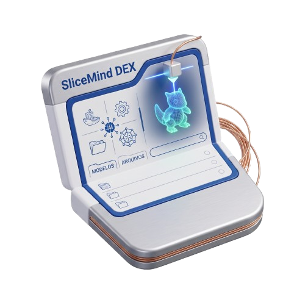
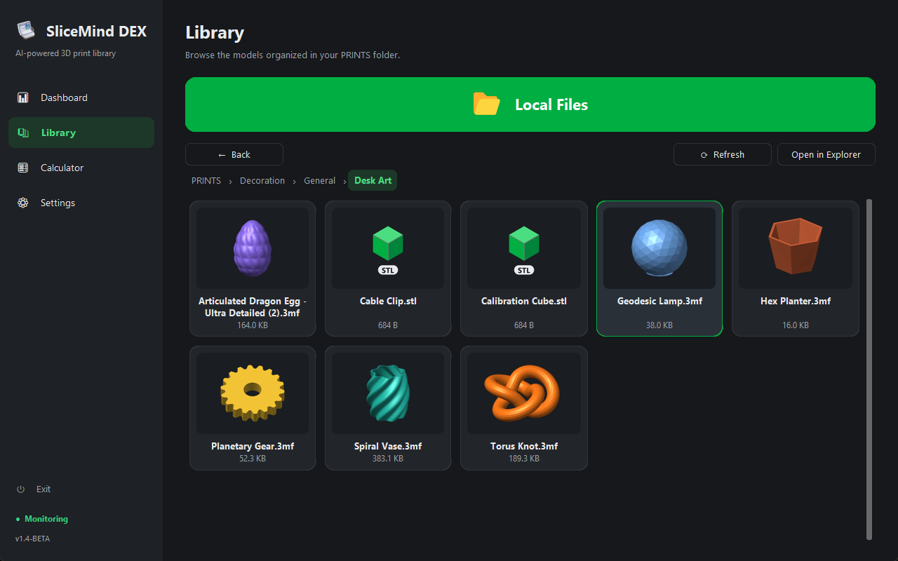
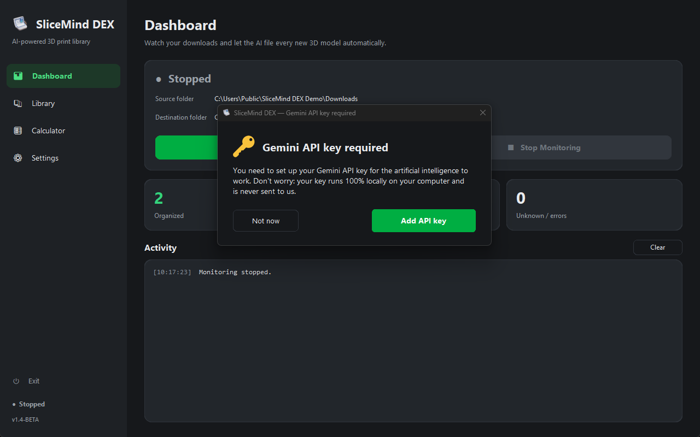
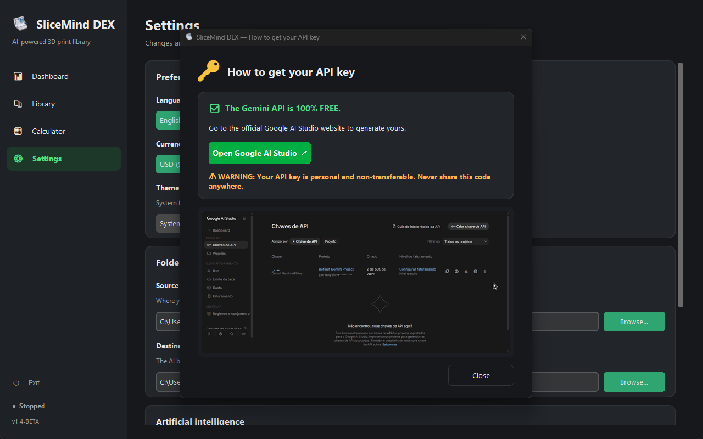
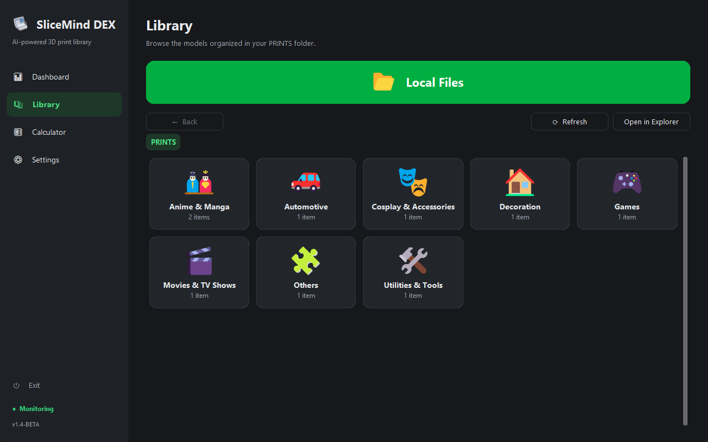
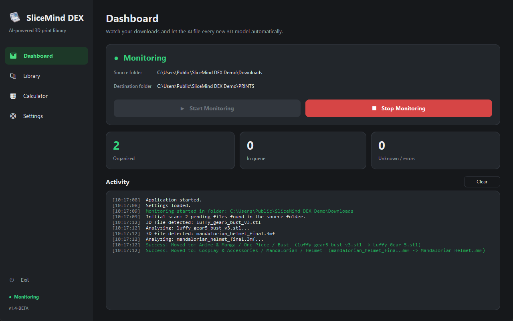
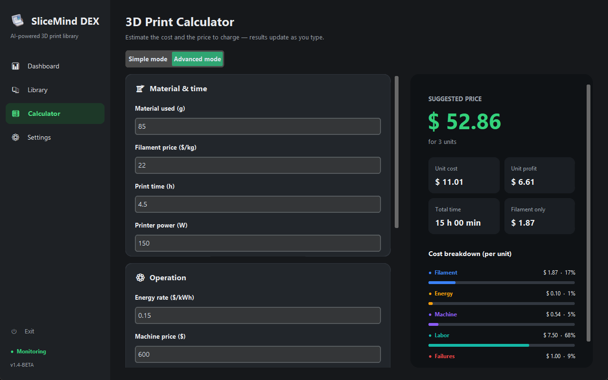
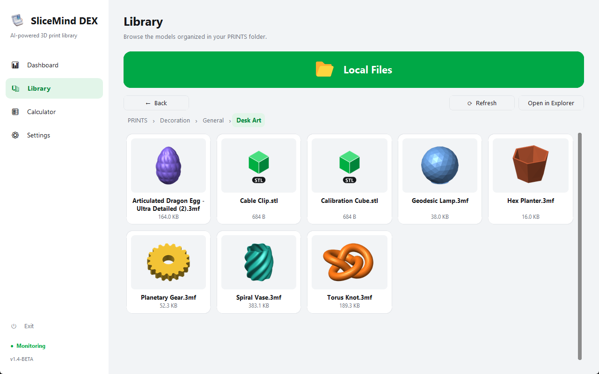

<p align="center">
  
</p>

<h1 align="center">SliceMind DEX 🖨️</h1>

<p align="center">
  <strong>The first AI-powered 3D printing file organizer and cost calculator.</strong>
</p>

<p align="center">
  <a href="https://github.com/keven-hatescoding/SliceMind-DEX/releases"></a>
  
  
  
  <a href="LICENSE"></a>
</p>

<p align="center">
  <a href="#-whats-new">What's New</a> •
  <a href="#-core-features">Features</a> •
  <a href="#-installation--getting-started">Installation</a> •
  <a href="#-how-to-use--first-setup">How to use</a> •
  <a href="#-privacy--security">Privacy</a> •
  <a href="#-documentação-em-português">🇧🇷 Português</a>
</p>

---

> 🎥 **Full Video Tutorial:** [Work in progress / Em desenvolvimento] - I am currently editing a complete showcase and setup guide for the app. The link will be available here next week!

---

<p align="center">
  
</p>

Every week you download dozens of `.stl`, `.3mf` and `.obj` files — and your Downloads folder turns into a graveyard of `final_v2_FIXED (3).stl`. **SliceMind DEX** watches that folder for you, asks Google Gemini what each model is, and files it into a clean, browsable library: **category → franchise → item type**, with a tidy file name. It also tells you how much to charge for each print.

## 📝 What's New

**1.4-BETA** — help with the Gemini API key:

- 🔑 **No more guessing.** If you click **Start Monitoring** without an API key, SliceMind DEX explains what it is (it stays on your computer and is never sent to us) and the **Add API key** button takes you straight to the field in Settings.
- ❓ **Step-by-step guide.** A green **?** next to the API key field opens **How to get your API key**: the Gemini API is free, a button to Google AI Studio, a reminder to never share your key and an animated walkthrough.

<table>
  <tr>
    <td></td>
    <td></td>
  </tr>
  <tr>
    <td align="center"><em>Starting without a key</em></td>
    <td align="center"><em>How to get your API key</em></td>
  </tr>
</table>

**1.3-BETA** — *PrintDex* is now **SliceMind DEX**:

- 🏷️ Same app, new name everywhere: window, tray, installer (`SliceMindDEX-Installer.exe`) and install folder (`C:\Program Files (x86)\SliceMind DEX`).
- 🎨 **New visual identity** — a new app icon in the window, taskbar, tray, shortcuts and installer.
- 🔁 **Nothing to redo when upgrading.** The installer replaces PrintDex in place, and on first launch your settings (folders, API key, language, calculator values) are copied over automatically. Your models stay exactly where they are.

**1.2.1-BETA** (fix) — changes since 1.2-BETA:

- 🖱️ **Click anywhere on a card.** The hand cursor now shows over the whole Library card, including its margins and the border of the thumbnail frame, which used to show the normal arrow. Clicking a file card opens the model in your default slicer; the card highlights on hover.

**1.2-BETA** — changes since 1.1-BETA:

- 🖼️ **Model thumbnails in the Library.** Every file now shows the same preview Windows Explorer shows. When Windows has none, SliceMind DEX uses the image your slicer (Bambu Studio, PrusaSlicer, OrcaSlicer…) embeds inside `.3mf` files; otherwise you get a generic 3D-file icon with the extension.
- 🗃️ **New file cards** with the thumbnail, the name (long names are shortened in the middle, so the end — like `(2).3mf` — stays visible) and the file size.
- ⚡ **Faster, smoother Library.** Thumbnails load in the background and are cached, and large folders no longer freeze the window (a 120-file folder used to freeze it for about 4 seconds).
- ℹ️ The new installer upgrades any previous version in place and keeps your settings and library.

Full history: [CHANGELOG.md](CHANGELOG.md).

## ✨ Core Features

- 🤖 **AI Auto-Organizer (powered by Google Gemini)** — Watches your Downloads folder in real time. When a 3D file finishes downloading, Gemini reads its file name, identifies the universe it belongs to and moves it to `PRINTS / Category / Franchise / Item type / Clean name.ext`. Files downloaded while the app was closed are picked up on the next start.
- 🗂️ **Locked, consistent categories** — The AI can only use 8 fixed top-level folders, so the same character never ends up in three different places: `Anime & Manga`, `Movies & TV Shows`, `Games`, `Utilities & Tools`, `Decoration`, `Automotive`, `Cosplay & Accessories` and `Others`. Folder names follow the app language — English by default (also used for Chinese) and Portuguese when the app is set to PT-BR.
- 🧬 **Smart Deduplication** — Before saving, SliceMind DEX compares the new file byte-for-byte with what is already in the library. Identical downloads are discarded instead of piling up as `file (1)`, `file (2)`… saving disk space.
- 🧮 **Advanced 3D Print Calculator** — A *Simple* mode for a quick quote (filament + energy + margin) and an *Advanced* dashboard with machine depreciation, manual labor, failure risk, quantity and a visual cost breakdown. Results update as you type.
- 📚 **Visual Library** — Browse your collection as cards: themed icons for categories and a **thumbnail of every model** (the same preview Windows Explorer shows, or the one your slicer embedded in the `.3mf`). Jump straight to any folder in Explorer with the **Local Files** button, and open a model in your slicer with one click.
- 🔔 **System Tray Integration** — Closing the window keeps SliceMind DEX running silently in the notification area, still organizing your downloads. A green badge shows when monitoring is on.
- 🌍 **Global Support** — Interface in **English, Português (Brasil) and 简体中文**, and currency formatting for **BRL, USD, EUR and CNY**. Light, dark or automatic (system) theme.

<table>
  <tr>
    <td></td>
    <td></td>
  </tr>
  <tr>
    <td align="center"><em>Library — locked categories</em></td>
    <td align="center"><em>Dashboard — real-time activity</em></td>
  </tr>
  <tr>
    <td></td>
    <td></td>
  </tr>
  <tr>
    <td align="center"><em>Calculator — Advanced mode</em></td>
    <td align="center"><em>Thumbnails — light theme</em></td>
  </tr>
</table>

## 📦 Installation & Getting Started

**Requirements:** Windows 10 or 11 (64-bit) and a free Google Gemini API key. Nothing else — Python and every library are bundled in the installer.

1. Open the [**Releases**](https://github.com/keven-hatescoding/SliceMind-DEX/releases) page.
2. Under **Assets**, download **`SliceMindDEX-Installer.exe`**.
3. Run it, choose your language and follow the wizard. SliceMind DEX is installed in `C:\Program Files (x86)\SliceMind DEX`, and its library folder `PRINTS` is created there with write permission for your user — no need to run the app as administrator.

> [!WARNING]
> **Windows SmartScreen notice.** SliceMind DEX is an open-source project and its installer is not signed with a paid digital certificate, so Windows may show a blue **"Windows protected your PC"** screen. This is expected for unsigned apps.
> Click **More info** → **Run anyway** to continue. Your browser may also warn that the file "isn't commonly downloaded" — choose **Keep**.
> Prefer to check it first? The full source code is in this repository, and you can [build the installer yourself](#-build-from-source).

## 🚀 How to Use & First Setup

1. **First-run setup (Onboarding).** On the first launch, a setup window opens before anything else:
   - **Source folder** — your browser's **Downloads** folder (suggested automatically).
   - **Library folder (PRINTS)** — already filled with the app's default. ⚠️ **Keeping the default is strongly recommended.**

   Click **Finish** and the app opens.
2. **Add your Gemini API key.** Get a free key at [Google AI Studio](https://aistudio.google.com/apikey), then go to **Settings → Artificial intelligence**, paste it into **Gemini API key** and click **Save**. The key is stored only on your computer. Never used an API key? Click the green **?** next to the field for a step-by-step guide — and if you try to start monitoring without a key, the app explains what to do and takes you straight to the field.
3. **Start monitoring.** On the **Dashboard**, click **Start Monitoring**. New downloads are analyzed and moved automatically; the activity log shows every step.
4. **Browse and quote.** Use the **Library** to explore your models and the **Calculator** to price a print.
5. **Background mode.** Closing or minimizing the window sends SliceMind DEX to the system tray (on Windows 11 the icon may be under the **^** arrow). Click the icon to reopen it; right-click → **Exit** to quit for good.

> [!TIP]
> On Gemini's free tier, SliceMind DEX analyzes at most 10 files per minute to stay within the rate limit. Large batches are simply queued.

## 🔒 Privacy & Security

- Your **API key** and settings are stored locally in `%APPDATA%\SliceMind DEX\sliceminddex.db`. They are never written to the source code, to the installer or to this repository.
- Only the **file name** of each model is sent to Google Gemini — never the file contents. On Gemini's free tier, Google may use the data it receives to improve its products; see the [Gemini API terms](https://ai.google.dev/gemini-api/terms).
- Uninstalling SliceMind DEX never deletes your models: the `PRINTS` folder is kept if it contains files.

## 🔧 Build from Source

```bash
git clone https://github.com/keven-hatescoding/SliceMind-DEX.git
cd SliceMind-DEX
pip install -r requirements.txt
python main.py
```

To produce `dist\SliceMindDex.exe` and the installer, install [PyInstaller](https://pyinstaller.org) (`pip install pyinstaller`) and [Inno Setup 6](https://jrsoftware.org/isinfo.php), then run **`build.bat`**. Every build runs a self-test inside the packaged `.exe` and stops if any dependency is missing.

**Tech stack:** Python · CustomTkinter · Watchdog · Google Gen AI SDK (Gemini) · SQLite · pystray · Pillow · PyInstaller · Inno Setup.

## 📄 License

Released under the [MIT License](LICENSE).

---

# 🇧🇷 Documentação em Português

> 🎥 **Tutorial completo em vídeo:** [Em desenvolvimento] — estou editando um vídeo completo de apresentação e configuração do app. O link estará disponível aqui na próxima semana!

## O que é o SliceMind DEX

Toda semana você baixa dezenas de arquivos `.stl`, `.3mf` e `.obj`, e a pasta Downloads vira um cemitério de `final_v2_CORRIGIDO (3).stl`. O **SliceMind DEX** vigia essa pasta por você, pergunta ao Google Gemini o que é cada modelo e o arquiva numa biblioteca limpa e navegável: **categoria → franquia → tipo de item**, com um nome de arquivo organizado. E ainda calcula quanto cobrar por cada impressão.

## 📝 Novidades

**1.4-BETA** — ajuda com a API Key do Gemini:

- 🔑 **Sem adivinhação.** Se você clicar em **Iniciar Monitoramento** sem a API Key, o SliceMind DEX explica o que é (ela fica no seu computador e nunca é enviada para nós) e o botão **Adicionar API** leva direto ao campo nas Configurações.
- ❓ **Passo a passo.** Um **?** verde ao lado do campo da API Key abre **Como obter sua API Key**: a API do Gemini é gratuita, um botão para o Google AI Studio, o lembrete de nunca divulgar a sua chave e um passo a passo animado.

**1.3-BETA** — o *PrintDex* agora se chama **SliceMind DEX**:

- 🏷️ O mesmo app, com o nome novo em todo lugar: janela, bandeja, instalador (`SliceMindDEX-Installer.exe`) e pasta de instalação (`C:\Program Files (x86)\SliceMind DEX`).
- 🎨 **Nova identidade visual** — ícone novo na janela, barra de tarefas, bandeja, atalhos e instalador.
- 🔁 **Nada a refazer ao atualizar.** O instalador substitui o PrintDex, e na primeira abertura as suas configurações (pastas, API Key, idioma, valores da calculadora) são copiadas automaticamente. Os seus modelos continuam exatamente onde estão.

**1.2.1-BETA** (correção) — o que mudou desde a 1.2-BETA:

- 🖱️ **Clique em qualquer parte do card.** A mãozinha do mouse agora aparece em todo o card da Biblioteca, inclusive na margem e na borda do quadro da miniatura, onde antes aparecia a seta normal. Clicar num card de arquivo abre o modelo no seu fatiador padrão; o card destaca ao passar o mouse.

**1.2-BETA** — o que mudou desde a 1.1-BETA:

- 🖼️ **Miniaturas dos modelos na Biblioteca.** Cada arquivo agora mostra a mesma pré-visualização do Explorer do Windows. Quando o Windows não tem, o SliceMind DEX usa a imagem que o seu fatiador (Bambu Studio, PrusaSlicer, OrcaSlicer…) grava dentro do `.3mf`; senão, aparece um ícone genérico de arquivo 3D com a extensão.
- 🗃️ **Novos cards de arquivo** com a miniatura, o nome (nomes longos são cortados no meio, para o fim — como `(2).3mf` — continuar visível) e o tamanho do arquivo.
- ⚡ **Biblioteca mais rápida e fluida.** As miniaturas carregam em segundo plano e ficam em cache, e pastas grandes não congelam mais a janela (uma pasta com 120 arquivos travava a tela por cerca de 4 segundos).
- ℹ️ O novo instalador atualiza qualquer versão anterior por cima e mantém suas configurações e sua biblioteca.

Histórico completo: [CHANGELOG.md](CHANGELOG.md).

## ✨ Funcionalidades

- 🤖 **Organizador automático com IA (Google Gemini)** — Monitora a pasta Downloads em tempo real. Quando um arquivo 3D termina de baixar, o Gemini lê o nome do arquivo, identifica o universo a que ele pertence e o move para `PRINTS / Categoria / Franquia / Tipo de item / Nome limpo.ext`. Arquivos baixados com o app fechado são processados na próxima vez que ele abrir.
- 🗂️ **Categorias fixas e consistentes** — A IA só pode usar 8 pastas principais, então o mesmo personagem nunca vai parar em três lugares diferentes. Com o app em português: `Animes e Mangas`, `Filmes e Series`, `Jogos`, `Utilitarios e Ferramentas`, `Decoracao`, `Automotivo`, `Cosplay e Acessorios` e `Outros`. Em inglês (padrão, usado também para o chinês), as pastas ficam em inglês (`Anime & Manga`, `Games`…).
- 🧬 **Deduplicação inteligente** — Antes de salvar, o SliceMind DEX compara o novo arquivo byte a byte com o que já está na biblioteca. Downloads idênticos são descartados em vez de se acumularem como `arquivo (1)`, `arquivo (2)`…, economizando espaço em disco.
- 🧮 **Calculadora de Impressão 3D** — Um *Modo Simples* para orçamentos rápidos (filamento + energia + margem) e um *Modo Avançado* com depreciação da máquina, trabalho manual, risco de falha, quantidade e a anatomia visual do custo. Os resultados mudam enquanto você digita.
- 📚 **Biblioteca visual** — Navegue pela coleção em cards: ícones temáticos nas categorias e a **miniatura de cada modelo** (a mesma pré-visualização do Explorer do Windows, ou a que o fatiador gravou no `.3mf`). Abra qualquer pasta no Explorer pelo botão **Arquivos Locais** e abra um modelo no seu fatiador com um clique.
- 🔔 **Integração com a bandeja do Windows** — Fechar a janela mantém o SliceMind DEX rodando discretamente na área de notificação, organizando seus downloads. Um selo verde no ícone indica que o monitoramento está ativo.
- 🌍 **Suporte global** — Interface em **English, Português (Brasil) e 简体中文**, e formatação de valores em **BRL, USD, EUR e CNY**. Tema claro, escuro ou automático (segue o Windows).

## 📦 Instalação

**Requisitos:** Windows 10 ou 11 (64 bits) e uma API Key gratuita do Google Gemini. Mais nada: o Python e todas as bibliotecas já vêm dentro do instalador.

1. Abra a página de [**Releases**](https://github.com/keven-hatescoding/SliceMind-DEX/releases).
2. Em **Assets**, baixe o **`SliceMindDEX-Installer.exe`**.
3. Execute, escolha o idioma e siga o assistente. O SliceMind DEX é instalado em `C:\Program Files (x86)\SliceMind DEX`, e a pasta da biblioteca, `PRINTS`, é criada ali com permissão de escrita para o seu usuário — não é preciso abrir o app como administrador.

> [!WARNING]
> **Aviso do Windows SmartScreen.** O SliceMind DEX é um projeto de código aberto e o instalador não é assinado com um certificado digital pago, então o Windows pode mostrar uma tela azul **"O Windows protegeu o computador"**. Isso é normal em apps sem assinatura.
> Clique em **Mais informações** → **Executar assim mesmo** para continuar. O navegador também pode avisar que o arquivo "não é baixado com frequência" — escolha **Manter**.
> Prefere conferir antes? Todo o código-fonte está neste repositório, e você pode [gerar o instalador por conta própria](#-gerar-a-partir-do-código-fonte).

## 🚀 Como usar e configuração inicial

1. **Configuração inicial (Onboarding).** Na primeira vez que o app abre, aparece uma janela de configuração antes de tudo:
   - **Pasta de origem** — a pasta **Downloads** do seu navegador (já sugerida automaticamente).
   - **Pasta da biblioteca (PRINTS)** — já preenchida com o padrão do app. ⚠️ **É altamente recomendado manter o diretório padrão.**

   Clique em **Concluir** e o app abre.
2. **Cadastre sua API Key do Gemini.** Gere uma chave gratuita no [Google AI Studio](https://aistudio.google.com/apikey), vá em **Configurações → Inteligência artificial**, cole em **API Key do Gemini** e clique em **Salvar**. A chave fica salva só no seu computador. Nunca usou uma API Key? Clique no **?** verde ao lado do campo para ver o passo a passo — e, se tentar iniciar o monitoramento sem a chave, o app explica o que fazer e leva você direto ao campo.
3. **Inicie o monitoramento.** No **Painel**, clique em **Iniciar Monitoramento**. Os novos downloads são analisados e movidos automaticamente; o log de atividade mostra cada passo.
4. **Explore e faça orçamentos.** Use a **Biblioteca** para navegar pelos modelos e a **Calculadora** para precificar uma impressão.
5. **Segundo plano.** Fechar ou minimizar a janela manda o SliceMind DEX para a bandeja do sistema (no Windows 11 o ícone pode ficar sob a seta **^**). Clique no ícone para reabrir; botão direito → **Sair** para encerrar de vez.

> [!TIP]
> No plano gratuito do Gemini, o SliceMind DEX analisa no máximo 10 arquivos por minuto para respeitar o limite da API. Lotes grandes simplesmente entram na fila.

## 🔒 Privacidade e segurança

- Sua **API Key** e as configurações ficam salvas localmente em `%APPDATA%\SliceMind DEX\sliceminddex.db`. Elas nunca são gravadas no código-fonte, no instalador nem neste repositório.
- Só o **nome do arquivo** de cada modelo é enviado ao Google Gemini — nunca o conteúdo do arquivo. No plano gratuito do Gemini, o Google pode usar os dados recebidos para melhorar seus produtos; veja os [termos da API Gemini](https://ai.google.dev/gemini-api/terms).
- Desinstalar o SliceMind DEX nunca apaga seus modelos: a pasta `PRINTS` é mantida se tiver arquivos.

## 🔧 Gerar a partir do código-fonte

```bash
git clone https://github.com/keven-hatescoding/SliceMind-DEX.git
cd SliceMind-DEX
pip install -r requirements.txt
python main.py
```

Para gerar o `dist\SliceMindDex.exe` e o instalador, instale o [PyInstaller](https://pyinstaller.org) (`pip install pyinstaller`) e o [Inno Setup 6](https://jrsoftware.org/isinfo.php) e rode o **`build.bat`**. Todo build executa um autodiagnóstico dentro do `.exe` empacotado e para se faltar alguma dependência.

## 📄 Licença

Distribuído sob a [Licença MIT](LICENSE).
